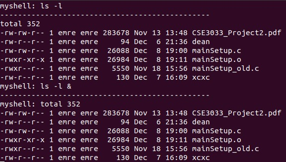
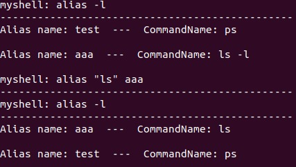
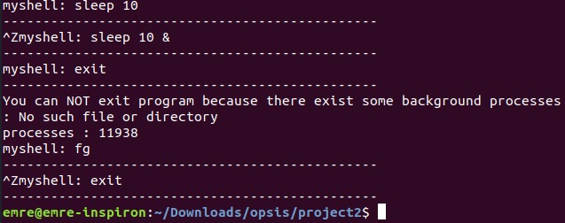
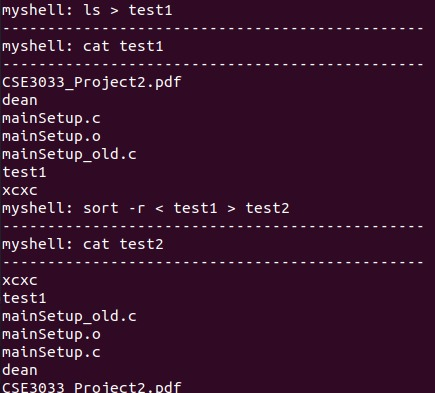
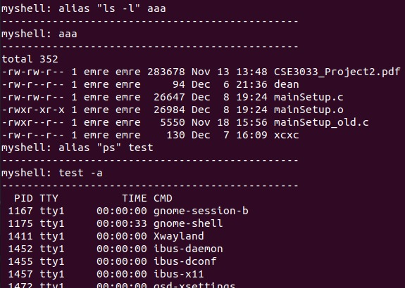
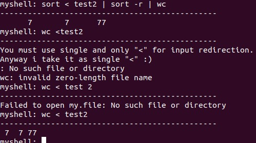

# Simple-Shell-Terminal

Purpose of this project is creating our simple shell for exec the linux commands. Our shell also has some built in
commands like alias/unalias, clr (clear the screen), ^z (Stop running foreground process, fg (move all background processes
to foreground) and exit.  
Our shell also supports pipes "|" and input redirections ">,<,>>,<<,2>". And all these operations can work together.

For executing linux command we use execl, and we do not use system() function for calling linux commands.
We use system() function only in our clr and exit command.

Some outputs of program: 

